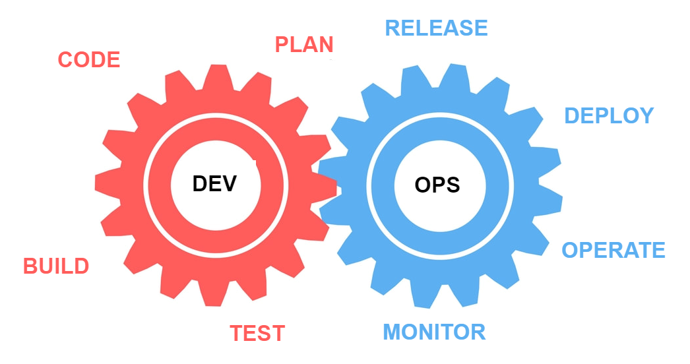

CLOUD - AWS
-

### What is cloud computing?

Cloud computing is the delivery of computing services over the internet or "the cloud" such as:

- servers
- storage
- databases
- networking
- software
- analytics

### Benefits of cloud computing:

- cost savings
- cost effective (you dont need to pay up front)
- very easy to use
- faster delivery of software to market
- improved security

### Why should we use cloud computing?

Cloud computing has plenty of advantages over on-premises IT infrastructure:

- increased agility
- lower costs
- reduced maintenance

### How does cloud computing fit into DevOps?

Cloud computing provides flexible infrastructure than helps
with continuous integration and delivery of software.

### How does cloud computing benefit businesses?

Cloud computing can help with:

- reducing costs
- increasing efficiency
- better agility
- accessing advanced technologies that could be expensive or difficulty to deploy on local machine

### Login in AWS

(GitBash commands)

`mv file_name_to_move(mateusz...) location_where_you_want_to_move_it (~/.ssh)`

`cd .ssh` access .ssh file 

`nano tech221.pem` open up notepad and paste KEY

`ctrl + s (save)   &   ctrl + x (close)`

`cat tech221.pem` to check changes in tech221.pem file

DevOps role
-

### What is DevOps?

DevOps is combination of practises, tools and cultural philosophies that increase 
organization's ability to deliver apps and services more efficiently. It also allows development 
and IT operations to collaborate and work together.

### Why DevOps?

DevOps helps organizations to deliver software faster, with better quality and reliability
while continuously improving communication and collaboration between teams. It also helps to reduce costs.

### Benefits of DevOps?

- faster time-to-market 
- improved quality
- better reliability of software releases
- increased collaboration and communication
- better visibility and transparency into the software development process

### The four key pillars of DevOps are:

- Culture: DevOps promotes the culture of collaborations, communication and continuous improvement.
- Automation: DevOps relies on automation to streamline processes and reduce manual effort.
- Measurement: DevOps highlight the importance of measuring performance and using data to make decisions.
- Sharing: DevOps encourages sharing knowledge, tools and resources to improve efficiency and productivity.
