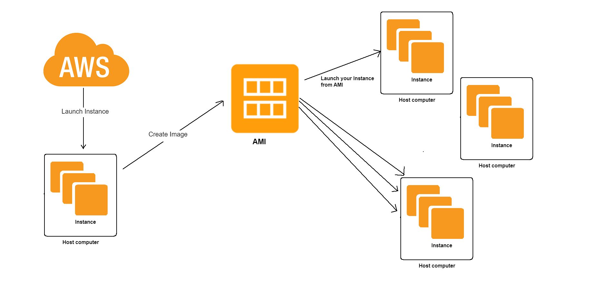

Creating AWS Image of our Instance
-

1. Go to AWS console and find "EC2" in the search box
2. Select and mark your current instance
3. Click `Actions` - `Images and templates` - `Create image`
4. Assign a "name" to your AMI `mateusz_tech221_nginx_ami`
5. If you want you can write a description `need security with port 80 & ssh connection with port 80`
6. You can also add Tags

### Now we need to find our newly created AMI
- Dash board on the left - AMIs

### To launch an instance from our AMI after `termination`:
- Check the box of your AMI
- In Actions click `Launch instance from AMI`
- Select `Security group` 
- Go back to `Instances`
- Find the newly made Instance and by pasting your IP into browser check if the Nginx works

### Reconnecting the `.ssh key` with your AMI Instance
- Make sure that Instance is running
- Press `Connect`
- Go to SSH Client
- Copy bottom command `$ ssh -i "tech221.pem" root@ec2-3-252-242-137.eu-west-1.compute.amazonaws.com` add `-y` at the end
- Change `root` to `ubuntu`
- Paste it into GitBash