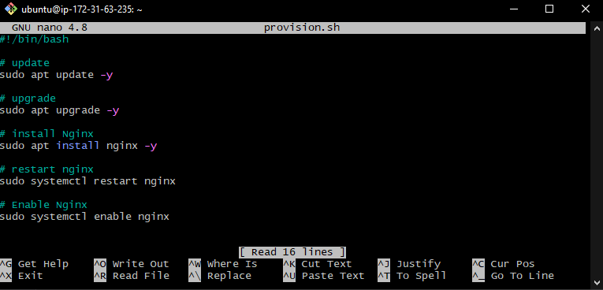

Creating Script to automate the process of installing Nginx.
-

1. Go to GitBash.
2. Use command `sudo nano <filename.sh>` to make `.sh` file.
3. In the file we need to type in the script:

4. `CTRL + s` to save it, `CTRL + x` to exit.
5. To make it executable use command `sudo chmod +x <filename.sh>` .
6. To run the script use command `sudo ./<filename.sh>`.
